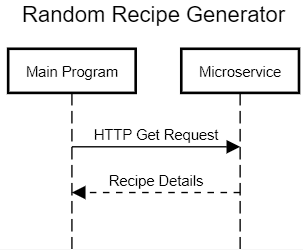

# Random Recipe Generator Microservice
Gives the detailed recipe instructions for a randomly chosen recipe from the given list of recipe IDs.
Note: You must have Node installed to run the microservice per the directions below. As of writing this, the current recommended version of Node is 20.9.0

HOW TO USE: 

1. Input your Spoonacular API key into the microservice.js file (line 4)
2. Start the microservice by navigating to the cs361_microservice directory and typing "node microservice.js" into a terminal
3. Send a GET request to http://localhost:8000?recipes=${recipeIDs} via another program
    1. recipeIDs should be a stringified list of recipe IDs obtained from Spoonacular
    2. See example_call.js for an example on how to create this stringified list of recipe IDs
At this point, the response from this GET request will contain JSON formatted detailed recipe information, which you can then parse

HOW TO RUN AN EXAMPLE CALL:

1. Follow steps 1 and 2 above.
2. Input your Spoonacular API key into the example_call.js file (line 4)
3. With the microservice still running in a separate terminal, open a new terminal, navigate to the cs361_microservice directory and type "node example_call.js"
At this point, you should see the stringified JSON data logged to the console, which is the detailed recipe instructions for the randomly chosen recipe

KNOWN ISSUES:

1. Some recipes will not actually have any detailed instructions provided from Spoonacular (such as recipe ID 73420). In this case, the microservice will just send back empty data.
2. Some recipes will only contain very minimal information (such as recipe ID 157103), this is something to keep an eye out for as well.

UML Sequence Diagram

